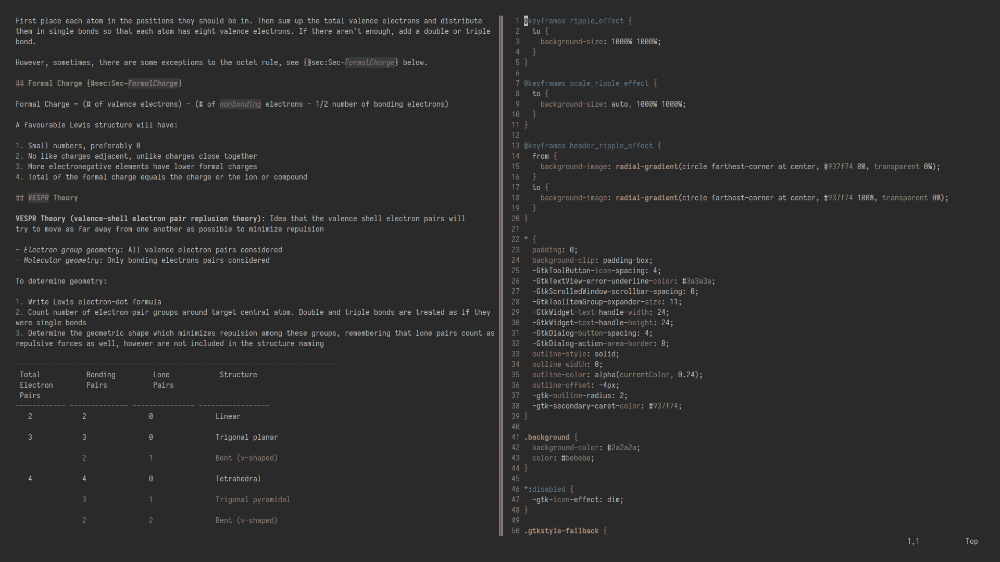

# sayo

sayo is a warm-toned, low contrast colorscheme designed for reading and study. The goal of sayo is to be a desaturated colorscheme with a warm brown feel, allowing comfortable reading for long periods of time.

While being primarily designed for prose, sayo is also suitable for code as well.

## Preview

## Colors

Name | Hex  | Preview
---- | ---- | -------
Color0 | #2a2a2a | 
Color8 | #3a3a3a | 
Color 1/9 | #637a8a | 
Color 2/10 | #aa8f7c | 
Color 3/11 | #8b8f7e | 
Color 4/12 | #987a6b | 
Color 5/13 | #877979 | 
Color 6/14 | #937f74 | 
Color 7/15 | #bebebe | 

## Inspiration

- 
- 
- 

